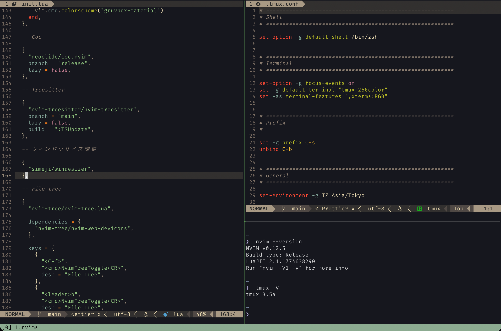

# dotfiles

Personal configuration files for my development environment on macOS.



## Setup

- Neovim
- tmux
- lazy.nvim
- nvim-treesitter
- coc.nvim
- nvim-tree
- lualine
- fzf

## Structure

```text
dotfiles/
├── nvim/
│   ├── init.lua
│   ├── coc-settings.json
│   └── lazy-lock.json
└── tmux/
    └── .tmux.conf
```

## Environment

- macOS
- zsh
- Neovim 0.12+
- tmux

## Notes

These configurations are mainly for my personal development workflow.
